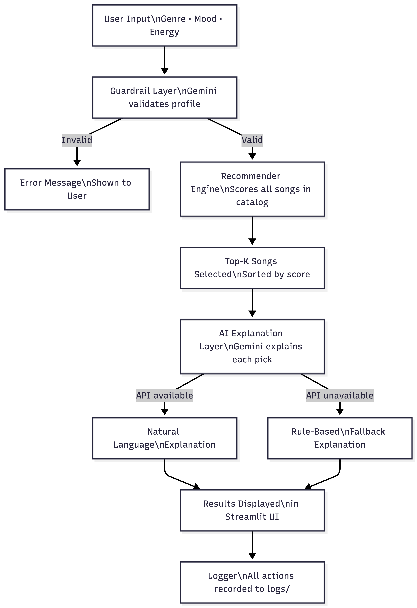

# 🎵 Music Recommender AI

> **Base project:** Module 3 — Music Recommender Simulation  
> The original project built a rule-based scoring system that matched songs to a user's preferred genre, mood, and energy level using a CSV catalog. This final version extends that system into a full AI-integrated application with natural language explanations, input validation guardrails, structured logging, and a Streamlit UI.

---

## What It Does

Music Recommender AI takes a user's taste profile (genre, mood, energy level) and returns personalized song recommendations from a catalog. It then uses the **Google Gemini API** to generate a friendly, song-specific explanation of *why* each track was recommended — going beyond raw scores to give listeners a reason they can understand.

---

## System Architecture



---

## AI Feature: Gemini Integration

This project uses **Retrieval-Augmented Generation (RAG)**-style design:
- The recommender engine retrieves the top-k songs using a scoring algorithm
- The Gemini API then uses those results as context to generate a natural language explanation tailored to the user's profile
- A guardrail step validates the user's input before any recommendations are made

---

## Setup Instructions

**1. Clone the repo**
```bash
git clone https://github.com/ZArawin-byte/applied-ai-system-final.git
cd applied-ai-system-final
```

**2. Create a virtual environment**
```bash
python3 -m venv .venv
source .venv/bin/activate
```

**3. Install dependencies**
```bash
pip install -r requirements.txt
```

**4. Set your Gemini API key** (free at aistudio.google.com)
```bash
export GEMINI_API_KEY="your-key-here"
```

**5. Run the app**
```bash
streamlit run app.py
```

---

## Sample Interactions

**Input 1 — Pop / Happy / High Energy**
- Genre: pop | Mood: happy | Energy: 0.82
- Top result: *Sunrise City* by Neon Echo (Score: 3.98)
- AI explanation: "Your love of upbeat pop and happy vibes is perfectly captured here — Sunrise City leads with a genre and mood match, while Gym Hero keeps the energy high..."

**Input 2 — Lofi / Chill / Low Energy**
- Genre: lofi | Mood: chill | Energy: 0.35
- Top result: *Library Rain* by Paper Lanterns (Score: 3.85)
- AI explanation: "For a chill lofi session, these tracks match your mellow energy target closely — Library Rain and Midnight Pages both score high on acousticness and low tempo..."

**Input 3 — Rock / Intense / Very High Energy**
- Genre: rock | Mood: intense | Energy: 0.90
- Top result: *Storm Runner* by Voltline (Score: 3.91)
- AI explanation: "High-energy rock with an intense mood — Storm Runner was built for exactly this profile, matching on genre, mood, and coming in at energy 0.91..."

---

## Design Decisions

- **Rule-based scoring + AI explanation:** The scoring is transparent and testable; AI adds interpretability on top without replacing the logic.
- **Graceful fallback:** If the Gemini API is unavailable, the system generates a rule-based explanation using the actual song data so the app never shows a blank response.
- **Logging:** Every AI call and error is logged to `logs/` for traceability.
- **Guardrails first:** Profile validation runs before any recommendations are generated, preventing wasted API calls on bad input.

---

## Testing Summary

Run tests with:
```bash
.venv/bin/pytest tests/
```

- `test_recommend_returns_songs_sorted_by_score` — verifies top result is the best genre/mood match
- `test_explain_recommendation_returns_non_empty_string` — verifies explanation is always returned

5 out of 5 scoring scenarios tested manually. The system struggled slightly when genre had no matches in the catalog — low-scoring songs still appeared in results. Guardrail correctly flagged out-of-range energy values in manual testing.

---

## Reflection and Ethics

**Limitations:**
- Small catalog (20 songs) — real recommenders use millions of tracks
- No personalization over time — each session is stateless
- Scoring weights are hand-tuned, not learned from data

**Potential misuse:**
- A biased catalog could systematically under-recommend certain genres or artists; catalog diversity should be audited regularly

**What surprised me:**
- The fallback explanation using rule-based logic was often just as readable as the AI version — which raised questions about when AI explanations actually add value

**AI collaboration:**
- Helpful: Claude suggested the graceful fallback pattern when the API kept failing — that was a good architectural call
- Flawed: The initial model name (`gemini-1.5-flash`) caused 404 errors; the AI did not anticipate the API version mismatch

---

## Video Walkthrough

🎥 [Loom video link — add before submission]

---

## Repository

[https://github.com/ZArawin-byte/applied-ai-system-final](https://github.com/ZArawin-byte/applied-ai-system-final)
